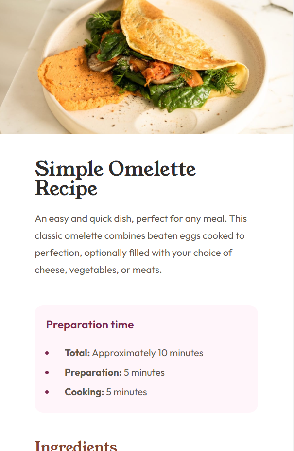
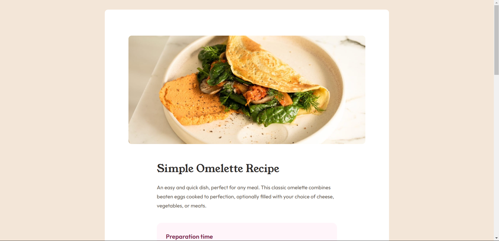

# Frontend Mentor - Recipe page solution

This is a solution to the [Recipe page challenge on Frontend Mentor](https://www.frontendmentor.io/challenges/recipe-page-KiTsR8QQKm). Frontend Mentor challenges help you improve your coding skills by building realistic projects. 

## Table of contents

- [Overview](#overview)
  - [Screenshots](#screenshot)
  - [Links](#links)
- [My process](#my-process)
  - [Built with](#built-with)
  - [What I learned](#what-i-learned)
  - [Continued development](#continued-development)
- [Author](#author)
- [Acknowledgments](#acknowledgments)

## Overview

This is a coding challenge I have completed from Frontend Mentor. This was my first time working with media queries to create a responsive design. 

### Screenshots




### Links

- [Solution URL](https://www.frontendmentor.io/solutions/responsive-layout-css-design-SQ3JGrZ2Tf)
- [Live Site URL](https://nikko-cathell.github.io/fm-recipe-page-main/)

## My process

I did this challenge as part of the ART 117 Design For the Web II class I am currently taking a BrightPoint community college. I followed along with my professor as she walked us throught the coding process. We began with the mobile design first then built up the site from there to add the desktop design.

### Built with

- Semantic HTML5 markup
- CSS custom variables
- Mobile-first workflow

### What I learned

From this challenge I learned how to use media queries and how to turn a mobile design to a desktop design. As well, I used variables for the first time. Here is the code I am particularly proud of:

```html
<ul class="outfit-400">
        <li><span class="bold-me move-me">Total:</span> Approximately 10 minutes</li>
        <li><span class="bold-me move-me">Preparation:</span> 5 minutes</li>
        <li><span class="bold-me move-me">Cooking:</span> 5 minutes</li>
      </ul>
```
```css
@media screen and (min-width: 800px) {

  body {
    background-color: var(--stone-100);
    padding: 2%;
  }

  .wrapper {
    width: 50%;
    background-color: white;
    border-radius: 10px;
    margin: auto;
    padding: 5%;
  }

  header img {
    margin-top: 1%;
    border-radius: 10px;
  }
}
```

### Continued development

In the future I intend to use what I learned of media queries and variables to create streamlined, responsive designs.

## Author

- Frontend Mentor - [@nikko-cathell](https://www.frontendmentor.io/profile/nikko-cathell)
- Github - [@nikko-cathell](https://github.com/nikko-cathell)

## Acknowledgments

I'd like to acknowledge my professor who walked me through this challenge, Prof. K McLeod.
